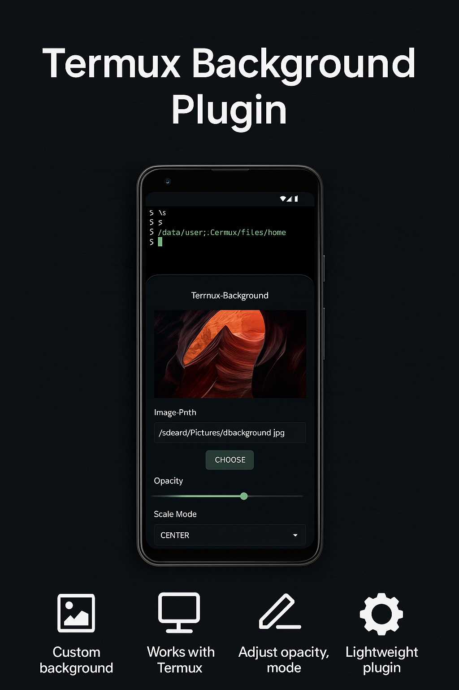
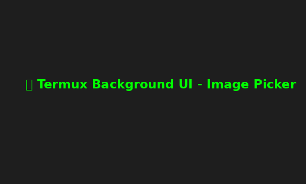

---

<p align="center">
  
</p>

<h1 align="center">Termux Background Plugin</h1>

<p align="center">
  A standalone Android plugin that lets you <strong>set custom background images</strong> in Termux — just like Windows Terminal.<br/>
  Fully offline. Web UI. No root needed.
</p>

---

## 🚀 Features

- 📷 Web-based UI for selecting background images (JPEG/PNG)
- 🧠 Auto-copies image to `~/.termux/background.png`
- ⚙️ Auto-generates `~/.termux/termux.properties`
- 🔁 Calls `termux-reload-settings` via Termux:API
- 🔧 Fully offline build & install support
- 🧩 `.deb` plugin installer + CLI command: `termux-background`
- ✅ Supports Android 7–14+, scoped storage safe

---

## 📷 Screenshots

| UI | Preview |
|----|---------|
|  |  |

---

## 📦 Installation (Plugin APK or CLI)

### Requirements
- ✔️ Termux (v0.119+)
- ✔️ Termux:API

### Option A: Install Plugin APK

```bash
adb install termux-background.apk
```

### Option B: Install CLI `.deb` Plugin

```bash
pkg install ./termux-background_1.0.0_all.deb
termux-background
```

---

## 💡 How It Works

- Moves selected image to: `~/.termux/background.png`
- Creates: `~/.termux/termux.properties`
- Calls: `termux-reload-settings`
- Persists until Termux is uninstalled

---

## 📁 Project Tree

```
termux-background/
├── app/src/main/java/com/termuxbackground/
│   ├── MainActivity.java
│   └── WebAppInterface.java
├── app/src/main/assets/
│   ├── termux-background-ui.html
│   └── install.sh
├── app/src/main/res/mipmap-*/ic_launcher.png
├── deb/termux-background_1.0.0_all.deb
├── dist/termux-background.apk
├── generate.sh
├── .gitignore
├── README.md
└── LICENSE
```

---

## 🧠 Build Offline

```bash
bash generate.sh
```

---

## 🛠 Developer Notes

- HTML5 Tailwind UI
- WebView bridge to native Java
- Persistent background image support via `.termux/`
- Compatible with Qualcomm, MediaTek, Unisoc

---

## 📜 License

MIT License. See [LICENSE](LICENSE).

